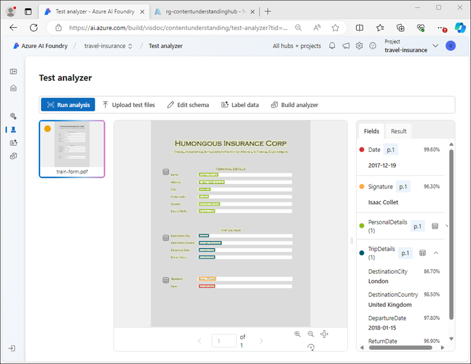

---
lab:
  title: 使用 Azure AI 內容瞭解分析內容
  module: Multimodal analysis with Content Understanding
---

# 使用 Azure AI 內容瞭解分析內容

在此練習中，您將使用 Azure AI Foundry 入口網站來建立內容瞭解專案，以從旅遊保險原則單擷取資訊。 接著，您將在 Azure AI Foundry 入口網站測試內容分析器，並透過內容瞭解 REST 介面加以取用。

本練習大約需要 **30** 分鐘的時間。

## 建立內容瞭解專案

讓我們從使用 Azure AI Foundry 入口網站開始建立內容瞭解專案。

1. 在網頁瀏覽器中，開啟 [Azure AI Foundry 入口網站](https://ai.azure.com) 於`https://ai.azure.com` 並使用您的 Azure 認證登入。

    Azure AI Foundry 入口網站的首頁看起來類似下圖：

    

1. 在首頁底部的 [快速尋找]**** 區段中，選取 [內容瞭解]****。
1. 在 **內容瞭解** 頁面，選取 **建立新的內容瞭解專案** 按鈕。
1. 在 **專案概觀** 步驟，為您的專案設定下列屬性，然後選取 **下一步**：
    - **專案名稱**： `travel-insurance`
    - **描述**：`Insurance policy data extraction`
    - **中樞**：建立新的中樞
1. 在 **建立中樞** 步驟，設定下列屬性，然後選取 **下一步**：
    - **Azure AI 中樞資源**： `content-understanding-hub`
    - 在**Azure 訂閱**： *選取您的 Azure 訂閱*
    - **資源群組**： *使用適當名稱來建立新資源群組*
    - **位置**： *選取任何可用的位置*
    - **Azure AI 服務**： *以適當的名稱建立新的 Azure AI 服務資源*
1. 在 **儲存體設定** 步驟，指定新的 AI 中心儲存體帳戶，然後選取 **下一步**。
1. 在 **檢閱** 頁面，選取 **建立專案**。 然後等候專案及其相關資源建立。

    當專案準備就緒時，它會在 **定義結構描述** 頁面中開啟。

    

## 檢閱 Azure 資源

當您建立 AI 中心和專案時，Azure 訂用帳戶會建立各種資源以支援該專案。

1. 在新瀏覽器索引標籤中，開啟位於 `https://portal.azure.com`的 [Azure 入口網站](https://portal.azure.com)；使用您的 Azure 認證登入。
1. 流覽至您為中樞建立的資源群組，並記下已建立的 Azure 資源。

    

## 定義自訂架構

您將組建一個可從旅遊保單中擷取資訊分析器。 您一開始會根據範例表單定義結構描述。

1. 從 `https://github.com/microsoftlearning/mslearn-ai-document-intelligence/raw/main/Labfiles/05-content-understanding/forms/train-form.pdf`下載 [train-form.pdf](https://github.com/microsoftlearning/mslearn-ai-document-intelligence/raw/main/Labfiles/05-content-understanding/forms/train-form.pdf)範例表單，並將其儲存至本機資料夾。
1. 傳回包含您內容瞭解專案的瀏覽器索引標籤，然後在**定義結構描述**頁面上傳您剛才下載的 ** train-form.pdf** 檔案。
1. 選取 **文件分析** 範本，然後選取 **建立**。

    結構描述編輯器提供一種方式來定義要從表單擷取的資料欄位，如右側所示。 表單如下所示：

    

    表單的資料欄位包含：
    
    - 與投保人相關的個人詳細資料集合。
    - 與需要保險之旅程相關的詳細資料集合。
    - 簽章和日期

    首先，我們會新增欄位來代表個人詳細資料作為資料表，然後在其中定義個人詳細資料的子字段。

1. 選取 **+新增** 以建立具有下列值的新欄位：
    - **欄位名稱**： `PersonalDetails`
    - **欄位描述**： `Policyholder information`
    - **實值型別**：表格
1. 選擇**儲存變更** (&#10004;)，注意會自動建立一個新的子欄位。
1. 使用下列值設定新的子欄位：
    - **欄位名稱**：`PolicyholderName`
    - **欄位描述**：`Policyholder name`
    - **值類型**：字串
    - **方法**：擷取
1. 使用 **+ 新增新子欄位**按鈕新增以下附加子欄位：

    | 欄位名稱 | 欄位描述 | 值類型 | 方法 |
    |--|--|--|--|
    | `StreetAddress` | `Policyholder address` | String | 擷取 |
    | `City` | `Policyholder city` | String | 擷取 |
    | `PostalCode` | `Policyholder post code` | String | 擷取 |
    | `CountryRegion` | `Policyholder country or region` | String | 擷取 |
    | `DateOfBirth` | `Policyholder birth date` | Date | 擷取 |

1. 新增完所有個人詳細資訊子欄位後，使用**返回**按鈕返回到結構描述的頂層。
1. 新增一個名為 **`TripDetails`** 的新*表格*欄位來表示受保行程的詳細資料。 然後向其中新增下列子欄位：

    | 欄位名稱 | 欄位描述 | 值類型 | 方法 |
    |--|--|--|--|
    | `DestinationCity` | `Trip city` | String | 擷取 |
    | `DestinationCountry` | `Trip country or region` | String | 擷取 |
    | `DepartureDate` | `Date of departure` | Date | 擷取 |
    | `ReturnDate` | `Date of return` | Date | 擷取 |

1. 返回結構描述的最上層，並新增下列兩個個別欄位：

    | 欄位名稱 | 欄位描述 | 值類型 | 方法 |
    |--|--|--|--|
    | `Signature` | `Policyholder signature` | String | 擷取 |
    | `Date` | `Date of signature` | Date | 擷取 |

1. 確認您已完成的結構描述看起來像這樣，然後儲存。

    

1. 在 **測試分析器** 頁面，如果分析未自動開始，請選取 **執行分析**。 然後等候分析完成並檢閱表單被確定為符合結構描述欄位的文字值。

    

    內容瞭解服務應該正確識別與架構中的欄位相對應的文字。 如果未能如此，您可以使用**標籤資料**頁面上傳另一個範例表單，並明確標識每個欄位的正確文字。

## 組建並測試分析器

現在您已經訓練了一個模型來從保險表單中擷取欄位，您可以組建一個分析器來與類似的表單一起使用。

1. 在左側瀏覽窗格中，選擇**組建分析器**頁面。
1. 選擇 **+ 組建分析器**並組建一個具有以下屬性的新分析器（輸入的內容與此處顯示的完全一致）：
    - **名稱**：`travel-insurance-analyzer`
    - **描述**：`Insurance form analyzer`
1. 等待新的分析器準備就緒（使用**重新整理**按鈕進行檢查）。
1. 從 `https://github.com/microsoftlearning/mslearn-ai-document-intelligence/raw/main/Labfiles/05-content-understanding/forms/test-form.pdf` 下載[test-form.pdf](https://github.com/microsoftlearning/mslearn-ai-document-intelligence/raw/main/Labfiles/05-content-understanding/forms/test-form.pdf)並將其儲存在本機資料夾中。
1. 返回**組建分析器**頁面並選擇 **travel-insurance-analyzer** 連結。 分析器結構描述中定義的欄位隨即顯示。
1. 在 **travel-insurance-analyzer** 頁面中，選擇**測試**。
1. 使用 **+ 上傳測試檔案**按鈕上傳 **test-form.pdf** 並執行分析以從測試表單中擷取欄位資料。

    

1. 檢視**結果**標籤以查看分析器返回的 JSON 格式的結果。 在下一個工作中，您將使用內容瞭解 REST API 向您的分析器提交表單並以此格式返回結果。
1. 關閉 **travel-insurance-analyzer** 頁面。

## 使用內容瞭解 REST API

現在您已經組建了一個分析器，您可以透過內容瞭解 REST API 從用戶端應用程式中使用它。

1. 切換到包含 Azure 入口網站的瀏覽器標籤（如果已關閉 `https://portal.azure.com`，則在新標籤中開啟它）。
1. 在內容瞭解中心的資源群組中，開啟 **Azure AI 服務**資源。
1. 在**概覽**頁面的**索引鍵和端點**部分中，檢視**內容瞭解**標籤。

    

    您將需要內容瞭解端點和其中一個索引鍵來從用戶端應用程式連接到您的分析器。

1. 使用頁面頂部搜尋欄右側的 **[\>_]** 按鈕在 Azure 入口網站中建立一個新的 Cloud Shell，並選擇 ***PowerShell*** 環境。 Cloud Shell 會在 Azure 入口網站底部的窗格顯示命令列介面，如下所示：

    

    > **注意**：如果您之前建立了使用 *Bash* 環境的 Cloud Shell，請將其切換到 ***PowerShell***。

1. 請注意，如需調整 Cloud Shell 的大小，您可以拖曳窗格頂端的分隔線，或者使用窗格右上方的 **&#8212;**、**&#10530;**、**X** 圖示，分別將窗格最小化、最大化或關閉窗格。 如需使用 Azure Cloud Shell 的詳細資訊，請參閱 [Azure Cloud Shell 文件](https://docs.microsoft.com/azure/cloud-shell/overview)。
1. 在 Cloud Shell 工具列中，在**設定**功能表中，選擇**轉到經典版本**（這是使用程式碼編輯器所必需的）。

1. 在 PowerShell 窗格中，輸入以下命令來複製此練習的 GitHub 存放庫：

    ```
    rm -r mslearn-ai-doc -f
    git clone https://github.com/microsoftlearning/mslearn-ai-document-intelligence mslearn-ai-doc
    ```

1. 複製存放庫之後，瀏覽至 **mslearn-ai-doc/Labfiles/05-content-understanding/code** 資料夾：

    ```
    cd mslearn-ai-doc/Labfiles/05-content-understanding/code
    ```

1. 輸入以下命令，編輯已提供的 **analyze_doc.py** Python 程式碼檔案：

    ```
    code analyze_doc.py
    ```
    Python 程式碼檔案會在程式碼編輯器中開啟：

    

1. 在程式碼檔案中，將**\<CONTENT_UNDERSTANDING_ENDPOINT\>** 預留位置替換為您的內容瞭解端點，並將**\<CONTENT_UNDERSTANDING_KEY\>** 預留位置替換為 Azure AI 服務資源的某個索引鍵。

    > **提示**：您需要調整 Cloud Shell 視窗的大小或將其最小化，以便從 Azure 入口網站中的 Azure AI 服務資源頁面複製端點和索引鍵 - 注意不要*關閉* Cloud Shell（否則您需要重複上述步驟）

1. 取代預留位置後，使用 **CTRL+S** 命令儲存變更，然後檢閱完成的程式碼，如下所示：
    - 向您的內容瞭解端點提交 HTTP POST 請求，指示 **travel-insurance-analyzer** 根據其 URL 分析表單。
    - 檢查 POST 操作的回應以擷取分析操作的 ID。
    - 反復向您的內容瞭解服務提交 HTTP GET 請求，直到操作不再執行。
    - 如果操作成功，則顯示 JSON 回應。
1. 使用**CTRL+Q**命令關閉程式碼編輯器，同時保持 Cloud Shell 命令列開啟。
1. 在 Cloud Shell 命令行窗格中，輸入下列命令來安裝 Python **要求**程式庫（用於程式碼中）：

    ```
    pip install requests
    ```

1. 安裝程式庫之後，在 Cloud Shell 命令行窗格中，輸入下列命令以執行 Python 程式碼：

    ```
    python analyze_doc.py
    ```

1. 檢閱程式的輸出，其中包括文件分析的 JSON 結果。

    > **提示**：Cloud Shell 控制台中的螢幕緩衝區可能不夠大，無法顯示整個輸出。 如果您想要檢閱整個輸出，請使用命令 `python analyze_doc.py > output.txt`執行程式。 然後，當程式完成時，使用命令 `code output.txt` 在程式碼編輯器中開啟輸出。

## 清理

如果您已完成使用內容瞭解服務，則應刪除在此練習中建立的資源，以避免產生不必要的 Azure 成本。

1. 在 Azure AI Foundry 入口網站中，瀏覽至 **travel-insurance** 專案並加以刪除。
1. 前往您在 Azure 入口網站中針對這些練習所建立的資源群組。

